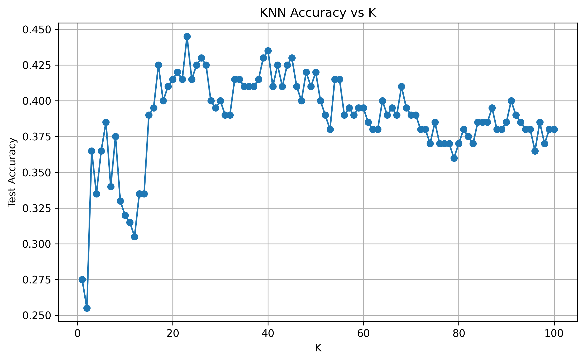
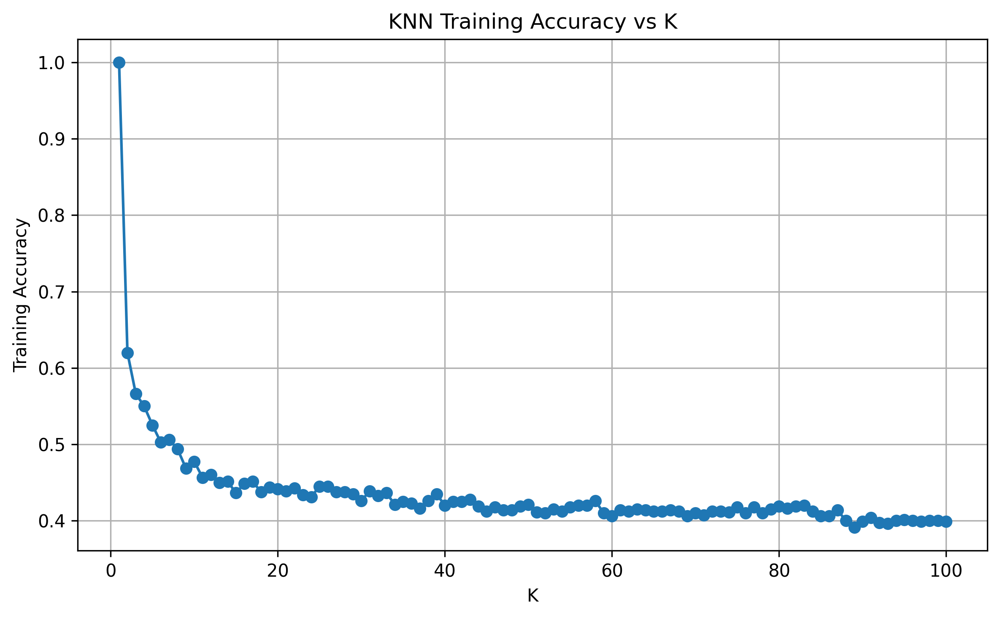

# KNN Customer Classification

A machine learning project that applies **K-Nearest Neighbors (KNN)** to classify telecommunications customers into four service categories. The project also investigates how the choice of **K** affects model performance, training behavior, and generalization.

## Overview

K-Nearest Neighbors is a supervised, instance-based learning algorithm that classifies a new observation based on the classes of its nearest training examples.

This project uses the `teleCust1000t.csv` telecommunications dataset containing **1,000 customers** and **11 input features**. The target variable, `custcat`, contains four customer service categories:

- Basic Service
- E-Service
- Plus Service
- Total Service

The project goes beyond a single KNN model by systematically evaluating **K values from 1 to 100** and analyzing both training and test accuracy.

## Objectives

- Implement K-Nearest Neighbors for multiclass classification.
- Understand the importance of feature scaling for distance-based algorithms.
- Evaluate KNN using test accuracy.
- Study the effect of different K values.
- Identify the best K within the tested range.
- Compare training and test performance as K changes.
- Understand the relationship between K, model flexibility, overfitting, and underfitting.
- Analyze why KNN performs relatively weakly on this feature space.

## Dataset

The project uses the `teleCust1000t.csv` telecommunications customer dataset from IBM's Machine Learning repository.

**Dataset:** [Telecommunications Customer Dataset](https://s3-api.us-geo.objectstorage.softlayer.net/cf-courses-data/CognitiveClass/ML0101ENv3/labs/teleCust1000t.csv)

The dataset contains 1,000 customer records and 11 input features used to classify customers into four service categories.

### Dataset Statistics

| Property | Value |
|---|---:|
| Samples | 1,000 |
| Input Features | 11 |
| Target | `custcat` |
| Classes | 4 |
| Missing Values | None |

### Features

| Feature | Description |
|---|---|
| `region` | Customer region |
| `tenure` | Years with the service |
| `age` | Customer age |
| `marital` | Marital status |
| `address` | Years at current address |
| `income` | Customer income |
| `ed` | Education level |
| `employ` | Years employed |
| `retire` | Retirement status |
| `gender` | Customer gender |
| `reside` | Number of people residing in the household |

### Target Distribution

| Class | Service Category | Customers |
|---:|---|---:|
| 1 | Basic Service | 266 |
| 2 | E-Service | 217 |
| 3 | Plus Service | 281 |
| 4 | Total Service | 236 |

The classes are reasonably balanced, so no special class-weighting or resampling strategy was used.

## Workflow

```text
Dataset
   ↓
Data Inspection
   ↓
Feature / Target Separation
   ↓
Stratified Train/Test Split
   ↓
Feature Scaling
   ↓
Initial KNN Model (K=3)
   ↓
Evaluate Test Accuracy
   ↓
Experiment with K = 1 to 100
   ↓
Compare Training and Test Accuracy
   ↓
Identify Best K
   ↓
Generate Visualizations
```

## Data Preprocessing

### Train/Test Split

The dataset is divided into:

- **80% training data**
- **20% test data**

A fixed random state is used for reproducibility, and stratification is applied to preserve the class distribution between the training and test sets.

### Feature Scaling

KNN is a distance-based algorithm, so feature scaling is important when features have different numerical ranges.

`StandardScaler` is fitted **only on the training data** and then used to transform both the training and test sets. This prevents test-set information from influencing the preprocessing stage.

## K-Nearest Neighbors

For a new observation, KNN identifies the nearest training observations and assigns the class based on the majority vote among those neighbors.

The value of **K** controls how many neighbors participate in the decision.

### Small K

A small K produces a more flexible model:

```text
Small K
   ↓
More sensitive to local observations
   ↓
High flexibility
   ↓
Higher risk of overfitting
```

### Large K

A larger K produces a smoother model:

```text
Large K
   ↓
More neighbors influence the prediction
   ↓
Smoother decision boundary
   ↓
Lower flexibility
   ↓
Potential underfitting
```

## Results

### Initial Model

The initial KNN model was trained with:

```text
K = 3
```

Result:

```text
Test Accuracy = 36.50%
```

### K Selection Experiment

The model was evaluated for every K value from **1 to 100**.

| Metric | Result |
|---|---:|
| Initial K | 3 |
| Initial Test Accuracy | 36.50% |
| Best K | 23 |
| Best Test Accuracy | 44.50% |

The highest test accuracy observed within the tested range was **44.50% at K = 23**.

## Test Accuracy vs K



The test accuracy varies across different K values and reaches its highest observed value at **K = 23**. Increasing K beyond this point does not produce a sustained improvement in test accuracy.

This experiment demonstrates why K should be treated as an important hyperparameter rather than selected arbitrarily.

## Training Accuracy vs K



Training accuracy is highest when K is very small. In particular, **K = 1 reaches 100% training accuracy**.

As K increases, training accuracy decreases because more neighboring observations influence each prediction, producing a smoother and less flexible decision boundary.

This provides a practical illustration of the trade-off between model flexibility and generalization.

## Interpretation

The relatively low maximum test accuracy of **44.50%** indicates that KNN does not separate the four customer categories particularly well using the available feature representation.

Possible contributing factors include:

- Several features provide relatively weak information about the target.
- KNN depends directly on meaningful distances between observations.
- Weakly informative features can introduce noise into distance calculations.
- Distance-based methods can become less effective as the feature space becomes more complex.
- The four classes may not form clearly separated neighborhoods.

The result is therefore useful from a learning perspective: a correctly implemented algorithm does not necessarily produce strong predictive performance on every dataset.

## Key Learnings

### Feature Scaling Matters

Because KNN relies on distance calculations, features should be placed on comparable scales before computing distances.

### K Controls Model Flexibility

- Small K → more flexible and locally sensitive.
- Large K → smoother and less flexible.

### Training Accuracy Can Be Misleading

K = 1 produces extremely high training accuracy, but training performance alone does not tell us how well the model generalizes to unseen data.

### Hyperparameter Selection Matters

Testing K systematically provides a better basis for selecting K than choosing a value arbitrarily.

### Algorithm Choice Depends on the Dataset

KNN is not guaranteed to perform well on every classification problem. The structure of the feature space strongly affects the usefulness of distance-based methods.

## Project Structure

```text
07-KNN-Customer-Classification/
│
├── main.py
│
├── src/
│   ├── __init__.py
│   ├── config.py
│   ├── data_loader.py
│   ├── preprocessing.py
│   ├── trainer.py
│   ├── evaluator.py
│   └── visualizer.py
│
├── outputs/
│   ├── knn_accuracy_vs_k.png
│   └── knn_training_accuracy_vs_k.png
│
├── requirements.txt
├── .gitignore
└── README.md
```

## Technologies Used

- Python
- Pandas
- NumPy
- Scikit-learn
- Matplotlib

### Machine Learning Concepts

- Supervised Learning
- Multiclass Classification
- K-Nearest Neighbors
- Feature Scaling
- Train/Test Split
- Hyperparameter Selection
- Model Evaluation
- Overfitting
- Underfitting
- Generalization
- Distance-Based Learning

## How to Run

### 1. Clone the repository

```bash
git clone https://github.com/ayushman652/KNN-Customer-Classification.git
cd KNN-Customer-Classification
```

### 2. Install dependencies

```bash
pip install -r requirements.txt
```

### 3. Add the dataset

Place `teleCust1000t.csv` at:

```text
datasets/
└── telecom_customer/
    └── teleCust1000t.csv
```

The dataset directory is excluded from version control through `.gitignore`.

### 4. Run the project

```bash
python main.py
```

The program will:

- Load and inspect the dataset.
- Perform the train/test split.
- Standardize the features.
- Train the initial KNN model with K = 3.
- Evaluate K values from 1 to 100.
- Identify the best observed K.
- Generate and save the accuracy plots in the `outputs/` directory.

## Limitations

- The best observed test accuracy is 44.50%.
- KNN can become computationally expensive as the training dataset grows because predictions require distance calculations against training observations.
- Distance-based methods can become less effective when the feature space contains weak or noisy dimensions.
- The experiment evaluates K from 1 to 100; broader hyperparameter optimization was not performed.
- Accuracy alone does not provide a complete view of multiclass classification performance.

## Conclusion

This project demonstrates the implementation and analysis of **K-Nearest Neighbors for multiclass customer classification**.

The experiment found:

```text
Initial K = 3
Test Accuracy = 36.50%

Best K = 23
Best Test Accuracy = 44.50%
```

Rather than focusing only on predictive accuracy, the project examines how K affects model flexibility, training behavior, and test performance, providing practical insight into both the strengths and limitations of KNN.
